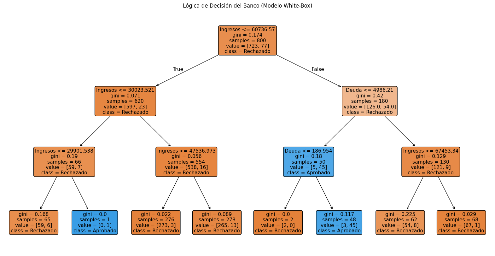

# Credit Risk Analysis: Decision Trees & Random Forests

## Project Overview
This project simulates a **FinTech Credit Approval System**. The goal is to predict whether a loan applicant should be **Approved** or **Rejected** based on financial data (Income, Credit Score, Debt).

I implemented and compared two Machine Learning approaches:
1.  **Decision Tree:** To prioritize **interpretability** (White-box model).
2.  **Random Forest:** To prioritize **robustness** and accuracy (Ensemble method).

## Business Problem
In the banking industry, **transparency** is as important as accuracy.
* **Challenge:** Deep Learning models often act as "Black Boxes", making it hard to explain to a customer (or a regulator) why a loan was denied.
* **Solution:** Using Decision Trees allows us to visualize the exact rule-set used for the decision, ensuring compliance with "Right to Explanation" standards.

## 📊 Key Insights & Visuals
The model revealed an interesting pattern in the synthetic data: **"Cash is King"**.
Contrary to popular belief, **Annual Income** proved to be the primary decision factor (Root Node), effectively filtering candidates before even considering their Credit Score.

### Decision Tree Visualization
Below is the logic flow the AI learned to approve/reject loans:



## Tech Stack
* **Python 3.x**
* **Scikit-Learn:** DecisionTreeClassifier, RandomForestClassifier.
* **Pandas & NumPy:** Data generation and manipulation.
* **Matplotlib:** Tree visualization.

## Installation & Setup (Reproducibility)
Following software engineering best practices, this project includes a dependency file to ensure you can reproduce the results locally.

1.  **Clone the repository:**
    ```bash
    git clone [https://github.com/](https://github.com/)anavaleroredondo-dev/Credit-Approval-Decision-Tree.git
    ```
2.  **Navigate to the project directory:**
    ```bash
    cd [NOMBRE-DEL-REPO]
    ```
3.  **Install dependencies:**
    ```bash
    pip install -r requirements.txt
    ```
4.  **Run the notebook:**
    Open `Credit_Approval_Decision_Tree.ipynb` in Jupyter or Google Colab.

## Model Performance
* **Decision Tree:** High interpretability, prone to overfitting on small datasets.
* **Random Forest:** Higher stability, aggregates 100 decision trees to reduce variance.

---
*Created by Ana Valero Redondo as part of my #BuildingInPublic journey in Machine Learning.*
